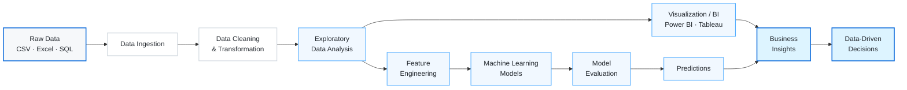
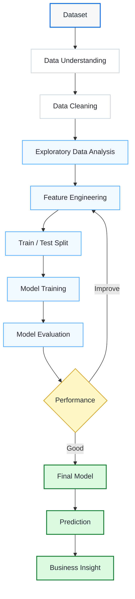
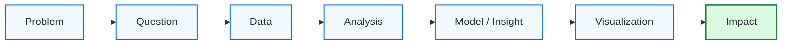

<div align="center">

# JISMON GEORGE

### AI / Machine Learning Engineer · Data Scientist · Data Analyst


<br>

<p align="center">
<a href="https://github.com/jismon-george"></a>&nbsp;
<a href="https://jismonportfolio.netlify.app/"></a>&nbsp;
<a href="https://www.linkedin.com/in/jismon-george-7b4251215"></a>
</p>

<p align="center">

</p>

</div>

---

<div align="center">

### `DATA → INTELLIGENCE → IMPACT`

**Turning raw information into meaningful insights, predictive models and practical solutions.**

</div>

---

# About Me

I'm **Jismon George**, an aspiring **AI / Machine Learning Engineer and Data Scientist** focused on transforming raw data into intelligent, understandable and useful solutions.

My work combines:

`Data Analytics` · `Machine Learning` · `Business Intelligence` · `Predictive Modelling` · `Data Visualization`

I enjoy working across the complete data lifecycle — from understanding a business problem and preparing raw data to discovering patterns, building models, creating dashboards and communicating insights.

### What I Focus On

| Domain | Focus |
|---|---|
| **Data Analytics** | Data Cleaning · EDA · Statistical Analysis · Data Transformation |
| **Machine Learning** | Regression · Classification · Feature Engineering · Model Evaluation |
| **Business Intelligence** | Power BI · Tableau · Excel · KPI Development |
| **Databases** | SQL · MySQL · RDBMS · Query Optimization |
| **Visualization** | Matplotlib · Seaborn · Power BI · Tableau |
| **AI / Emerging Tech** | Generative AI · LLMs · Deep Learning · MLOps |

---

# Technology Stack

## Programming & Data

<p align="center">


</p>

## Data Science & Machine Learning

<p align="center">


</p>

## Analytics & Business Intelligence

<p align="center">


</p>

## Development & Tools

<p align="center">


</p>

---

# Data Architecture

<div align="center">

### From Raw Data to Business Decisions

</div>



---

# Machine Learning Architecture



---

# Analytics Lifecycle

```mermaid
flowchart LR

    A["Business Problem"]
    --> B["Data Collection"]

    B --> C["Data Preparation"]

    C --> D["Exploratory Analysis"]

    D --> E["Model / Insight"]

    E --> F["Validation"]

    F --> G["Visualization"]

    G --> H["Business Decision"]

    H --> I["Impact"]

    classDef primary fill:#F1F8FF,stroke:#0969DA,stroke-width:1.5px,color:#24292F
    classDef process fill:#FFFFFF,stroke:#D0D7DE,stroke-width:1.5px,color:#24292F
    classDef final fill:#DAFBE1,stroke:#1A7F37,stroke-width:2px,color:#24292F

    class A,B,C,D,E,F,G primary
    class H process
    class I final
```



---

# Featured Projects

<table>
<tr>

<td width="50%" valign="top">

### Home Loan Default Prediction

Machine learning solution for predicting loan default risk using historical customer and financial data.

**Technology**

`Python` · `Pandas` · `NumPy` · `Scikit-learn`

**Focus**

`Classification` · `EDA` · `Feature Engineering` · `Model Evaluation`

<br>

<a href="https://github.com/jismon-george/Home-Loan-Default-Prediction">

</a>

</td>

<td width="50%" valign="top">

### Logistics Operations Analytics

Analytics project focused on shipment performance, delivery timelines, operational efficiency and KPIs.

**Technology**

`Python` · `Pandas` · `Power BI` · `Excel`

**Focus**

`EDA` · `KPI Analysis` · `Dashboards` · `Optimization`

<br>

<a href="https://github.com/jismon-george/Logistics-Operations-Analytics">

</a>

</td>

</tr>

<tr>

<td width="50%" valign="top">

### Texas Salary Prediction

Predictive analytics project estimating salaries using demographic, educational and employment-related factors.

**Technology**

`Python` · `Pandas` · `NumPy` · `Scikit-learn`

**Focus**

`Regression` · `Feature Selection` · `EDA` · `Validation`

<br>

<a href="https://github.com/jismon-george/TexasSalaryPrediction">

</a>

</td>

<td width="50%" valign="top">

### Sales Performance Dashboard

Interactive Power BI dashboard designed to monitor revenue, profit and business KPIs.

**Technology**

`Power BI` · `Excel` · `DAX` · `Data Modelling`

**Focus**

`KPIs` · `Drill-down` · `DAX` · `Business Intelligence`

<br>

<a href="https://github.com/jismon-george/Syntecxhub_Sales_Performance_Dashboar-d">

</a>

</td>

</tr>

<tr>

<td width="50%" valign="top">

### Student Performance Analysis

Statistical and exploratory analysis identifying factors affecting student performance.

**Technology**

`Python` · `Pandas` · `NumPy` · `Matplotlib` · `Seaborn`

**Focus**

`EDA` · `Statistics` · `Visualization`

<br>

<a href="https://github.com/jismon-george/Syntecxhub_Student_Performance_Analysis">

</a>

</td>

<td width="50%" valign="top">

### Customer Segmentation

RFM-based customer segmentation focused on customer behaviour and business value.

**Technology**

`Python` · `Pandas` · `Data Analysis`

**Focus**

`RFM` · `Segmentation` · `Customer Analytics`

<br>

<a href="https://github.com/jismon-george/-Customer-Segmentation-using-RFM-Analysis">

</a>

</td>

</tr>
</table>

---

# GitHub Analytics

<div align="center">


<br><br>


</div>

---

# Contribution Activity

<div align="center">


</div>

---

# Contribution Snake

<div align="center">

<!--
Uploaded fallback snake.
Place github-contribution-grid-snake.svg in the root of this repository.
-->


<br>

<sub>Contribution activity visualized with GitHub contribution snake.</sub>

<br><br>

<!-- Automatically generated personal snake -->

<picture>

<source
  media="(prefers-color-scheme: dark)"
  srcset="https://raw.githubusercontent.com/jismon-george/jismon-george/output/github-snake-dark.svg">

<source
  media="(prefers-color-scheme: light)"
  srcset="https://raw.githubusercontent.com/jismon-george/jismon-george/output/github-snake.svg">


</picture>

</div>

---

# Professional Experience

## Data Analytics Intern — iStudio

**May 2026 – June 2026**

Worked across practical data analytics, business intelligence and reporting workflows.

### Key Areas

| Category | Experience |
|---|---|
| **Data** | Collection · Cleaning · Transformation |
| **Analysis** | EDA · Statistical Analysis · Pattern Discovery |
| **Machine Learning** | Predictive Analytics · Model Development |
| **Business Intelligence** | KPI Development · Dashboard Development |
| **Reporting** | Business Reporting · Data Visualization |
| **Decision Support** | Data-driven Recommendations |

---

# Education

### Diploma in Data Science

**Blitz Academy · Kochi**

`2025 – 2026`

**Relevant Areas**

`Data Analytics` · `Machine Learning` · `Statistics` · `Business Intelligence` · `SQL & Databases`

### Bachelor of Computer Applications

**Gossner College · Ranchi**

`2021 – 2024`

---

# Certifications

<details>
<summary><b>View Certifications</b></summary>

<br>

| Certification | Provider |
|---|---|
| Machine Learning Models, Mathematics & Statistics – Level 1 | iStudio |
| Python for Data Science | IBM |
| Python Programming Certification | iStudio |
| Pandas for Data Analysis | iStudio |
| R Programming Certification | iStudio |
| Industry Interaction Program | Askan Technologies |
| Certificate of Internship – Data Science | Syntecxhub |

</details>

---

# Currently Learning

```yaml
profile:
  role: "AI / Machine Learning Engineer & Data Scientist"

core:
  - Data Analytics
  - Machine Learning
  - Predictive Modelling
  - Business Intelligence
  - SQL
  - Data Visualization

exploring:
  - Generative AI
  - Large Language Models
  - Deep Learning
  - MLOps
  - Data Engineering
  - Advanced Machine Learning

building:
  - Data Science Projects
  - Machine Learning Models
  - Interactive Dashboards
  - Analytics Solutions
```

---

# Problem Solving Framework



---

# Professional Principles

<table>
<tr>

<td width="25%" align="center">

### 01

**Understand**

Understand the problem before the data.

</td>

<td width="25%" align="center">

### 02

**Analyze**

Find patterns and meaningful signals.

</td>

<td width="25%" align="center">

### 03

**Build**

Turn insights into practical solutions.

</td>

<td width="25%" align="center">

### 04

**Impact**

Communicate results that support decisions.

</td>

</tr>
</table>

---

# Portfolio

<div align="center">

### Explore my complete Data Science portfolio

<br>

<a href="https://jismonportfolio.netlify.app/">

</a>

<br><br>

`Data Science` · `Machine Learning` · `Analytics` · `Business Intelligence`

</div>

---

# Let's Connect

<div align="center">

<p align="center">

<a href="https://jismonportfolio.netlify.app/"></a>&nbsp;

<a href="https://github.com/jismon-george"></a>&nbsp;

<a href="https://www.linkedin.com/in/jismon-george-7b4251215"></a>

</p>

<br>

> **Turning data into insights. Building intelligence from information.**

<br>


</div>

---

<!-- =========================================================
     CONTRIBUTION SNAKE GITHUB ACTION
     =========================================================

README.md cannot execute GitHub Actions.

Create this file separately:

.github/workflows/snake.yml

Use the following workflow:

------------------------------------------------------------

name: Generate Contribution Snake

on:

  push:
    branches:
      - main

  schedule:
    - cron: "0 0 * * *"

  workflow_dispatch:

jobs:

  generate:

    runs-on: ubuntu-latest

    permissions:
      contents: write

    steps:

      - name: Generate Contribution Snake
        uses: Platane/snk@v3

        with:

          github_user_name: ${{ github.repository_owner }}

          outputs: |
            dist/github-snake.svg
            dist/github-snake-dark.svg?palette=github-dark
            dist/github-snake-light.svg?palette=github-light

      - name: Publish Snake
        uses: peaceiris/actions-gh-pages@v4

        with:

          github_token: ${{ secrets.GITHUB_TOKEN }}
          publish_dir: ./dist
          publish_branch: output
          force_orphan: true
          commit_message: "Update contribution snake"

------------------------------------------------------------

GitHub Settings:

Repository
    ↓
Settings
    ↓
Actions
    ↓
General
    ↓
Workflow permissions
    ↓
Read and write permissions
    ↓
Save

Then:

Actions
    ↓
Generate Contribution Snake
    ↓
Run workflow

The workflow generates:

output/
├── github-snake.svg
├── github-snake-dark.svg
└── github-snake-light.svg

The README automatically loads the generated version from:

https://raw.githubusercontent.com/jismon-george/jismon-george/output/github-snake.svg

Dark version:

https://raw.githubusercontent.com/jismon-george/jismon-george/output/github-snake-dark.svg

Light version:

https://raw.githubusercontent.com/jismon-george/jismon-george/output/github-snake-light.svg

============================================================
END CONTRIBUTION SNAKE SETUP
============================================================ -->

<div align="center">

### Built with curiosity, data and continuous learning.

**JISMON GEORGE · 2026**

</div>
