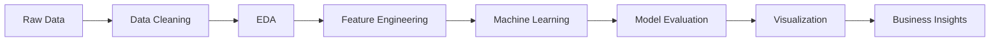

<!-- ========================================================= -->

<!--                    JISMON GEORGE README                   -->

<!-- ========================================================= -->

<div align="center">

# 👋 Hi, I'm JISMON GEORGE

### Data Science • Data Analytics • Machine Learning • Business Intelligence


<br>

<a href="https://github.com/jismon-george">
  
</a>
<a href="https://www.linkedin.com/in/jismon-george-7b4251215">
  
</a>
<a href="https://jismonportfolio.netlify.app/">
  
</a>

<br><br>


</div>

---

## 🧠 About Me

```text
I'm Jismon George — an aspiring Data Scientist focused on turning
raw data into meaningful insights and intelligent solutions.

I enjoy working across the complete analytics lifecycle:

        Raw Data
           ↓
     Data Cleaning
           ↓
    Data Exploration
           ↓
    Feature Engineering
           ↓
     Machine Learning
           ↓
   Visualization & BI
           ↓
    Business Insights
```

* 🎓 Diploma in Data Science
* 💻 BCA Graduate
* 📊 Focused on Data Analytics & Business Intelligence
* 🤖 Exploring Machine Learning & Predictive Analytics
* 🐍 Python enthusiast
* 🗄️ SQL & Database focused
* 📈 Building dashboards and analytical solutions
* 🧠 Interested in solving real-world problems using data
* 🚀 Continuously learning and building

---

## ⚡ Tech Stack

### Programming & Data

<p align="left">


</p>

### Data Science & Machine Learning

<p align="left">


</p>

### Analytics & Business Intelligence

<p align="left">


</p>

### Tools & Platforms

<p align="left">


</p>

---

## 🚀 Featured Projects

<table>
<tr>
<td width="50%">

### 🏦 Home Loan Default Prediction

Machine learning solution for predicting loan default risk using historical customer and loan data.

**Tech:** Python • Pandas • NumPy • Scikit-learn • Matplotlib • Seaborn

<a href="https://github.com/jismon-george/Home-Loan-Default-Prediction">

</a>

</td>

<td width="50%">

### 🚚 Logistics Operations Analytics

Analytics project focused on logistics performance, shipment trends, delivery timelines and operational KPIs.

**Tech:** Python • Pandas • Power BI • Excel • Jupyter

<a href="https://github.com/jismon-george/Logistics-Operations-Analytics">

</a>

</td>
</tr>

<tr>
<td width="50%">

### 💰 Texas Salary Prediction

Predictive analytics project for estimating salary using demographic, educational and employment-related factors.

**Tech:** Python • Pandas • NumPy • Scikit-learn

<a href="https://github.com/jismon-george/TexasSalaryPrediction">

</a>

</td>

<td width="50%">

### 📊 Sales Performance Dashboard

Interactive business intelligence dashboard for monitoring revenue, profit and key business KPIs.

**Tech:** Power BI • Excel • DAX • Data Modelling

<a href="https://github.com/jismon-george/Syntecxhub_Sales_Performance_Dashboar-d">

</a>

</td>
</tr>

<tr>
<td width="50%">

### 🎓 Student Performance Analysis

Exploratory and statistical analysis of student performance to identify factors affecting academic outcomes.

**Tech:** Python • Pandas • NumPy • Matplotlib • Seaborn

<a href="https://github.com/jismon-george/Syntecxhub_Student_Performance_Analysis">

</a>

</td>

<td width="50%">

### 👥 Customer Segmentation

RFM-based customer segmentation project focused on understanding customer behaviour and business value.

**Tech:** Python • Data Analysis • RFM Analysis

<a href="https://github.com/jismon-george/-Customer-Segmentation-using-RFM-Analysis">

</a>

</td>
</tr>
</table>

---

## 📊 GitHub Analytics

<div align="center">


</div>

<br>

<div align="center">


</div>

---

## 📈 Contribution Activity

<div align="center">


</div>

---

## 🐍 Contribution Snake

<div align="center">


</div>

---

## 💼 Experience

### 📊 Data Analytics Intern — iStudio

**May 2026 – June 2026**

Worked on practical data analytics, business intelligence and reporting workflows.

Key areas:

* Data collection and preparation
* Data cleaning and transformation
* Exploratory Data Analysis
* Predictive analytics
* KPI development
* Dashboard development
* Business reporting
* Data visualization
* Statistical analysis
* Data-driven recommendations

---

## 🏆 Certifications & Learning

| Certification                                               | Provider           |
| ----------------------------------------------------------- | ------------------ |
| Machine Learning Models, Mathematics & Statistics – Level 1 | iStudio            |
| Python for Data Science                                     | IBM                |
| Python Programming Certification                            | iStudio            |
| Pandas for Data Analysis                                    | iStudio            |
| R Programming Certification                                 | iStudio            |
| Industry Interaction Program                                | Askan Technologies |
| Certificate of Internship – Data Science                    | Syntecxhub         |

---

## 🎓 Education

**Diploma in Data Science**
Blitz Academy, Kochi
2025 – 2026

Relevant areas:

`Data Analytics` • `Machine Learning` • `Statistics` • `Business Intelligence` • `SQL & Databases`

<br>

**Bachelor of Computer Applications (BCA)**
Gossner College, Ranchi
2021 – 2024

---

## 🔭 Currently Working On

```yaml
focus:
  - Data Analytics
  - Machine Learning
  - Predictive Modelling
  - Business Intelligence
  - SQL & Database Systems
  - Data Visualization

building:
  - Data Science Projects
  - Interactive Dashboards
  - Machine Learning Solutions
  - Real-World Analytics Projects

learning:
  - Advanced Machine Learning
  - Artificial Intelligence
  - Predictive Analytics
  - Advanced SQL
```

---

## 🧩 My Data Science Workflow



---

## 💡 What I Bring

<table>
<tr>
<td align="center">📊<br><b>Analytics</b><br>Transforming data into insights</td>
<td align="center">🤖<br><b>ML</b><br>Building predictive solutions</td>
<td align="center">📈<br><b>BI</b><br>Creating KPI-driven dashboards</td>
<td align="center">🧠<br><b>Problem Solving</b><br>Data-driven thinking</td>
</tr>
</table>

---

## 🌱 Beyond Code

I believe good data science is not just about building models.

It is about:

> **Understanding the problem → Understanding the data → Finding the signal → Communicating the insight → Creating impact.**

---

## 📫 Let's Connect

<div align="center">

<a href="https://www.linkedin.com/in/jismon-george-7b4251215">

</a>

<a href="https://github.com/jismon-george">

</a>

<a href="https://jismonportfolio.netlify.app/">

</a>

</div>

<br>

<div align="center">

### ⭐ If you find my projects interesting, consider giving them a star!

<br>


</div>
