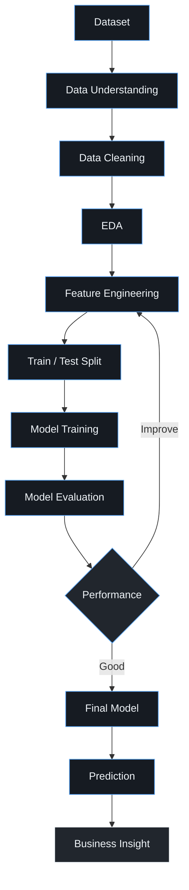
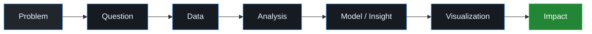

<div align="center">

# JISMON GEORGE

### Data Science · Data Analytics · Machine Learning · Business Intelligence


<br>

<a href="https://github.com/jismon-george">

</a>
&nbsp;
<a href="https://www.linkedin.com/in/jismon-george-7b4251215">

</a>
&nbsp;
<a href="https://jismonportfolio.netlify.app/">

</a>

<br><br>


</div>

---

## `01` · Profile

> **Data → Insight → Intelligence**

I'm **Jismon George**, an aspiring **Data Scientist** focused on transforming raw data into actionable insights and intelligent solutions.

My work spans **data analytics, business intelligence, exploratory data analysis, predictive modelling and machine learning**.

I enjoy working across the complete analytics lifecycle — from collecting and cleaning data to discovering patterns, building models, creating dashboards and communicating insights.

### Core Strengths

| Area                              | Focus                                                            |
| --------------------------------- | ---------------------------------------------------------------- |
| **Data Analytics**                | Data Cleaning · EDA · Statistical Analysis · Data Transformation |
| **Machine Learning**              | Predictive Modelling · Supervised Learning · Feature Engineering |
| **Business Intelligence**         | Power BI · Tableau · KPI Development · Reporting                 |
| **Data Engineering Fundamentals** | SQL · MySQL · RDBMS · Query Optimization                         |
| **Visualization**                 | Matplotlib · Seaborn · Power BI · Tableau · Excel                |

---

# `02` · Technology Stack

### Languages

<p align="center">

</p>

### Data Science

<p align="center">


</p>

### Business Intelligence

<p align="center">


</p>

### Development & Tools

<p align="center">

</p>

---

# `03` · Data Architecture

### End-to-End Analytics Architecture

```mermaid
flowchart LR

    A["Raw Data<br/>CSV · Excel · SQL"] 
    --> B["Data Ingestion"]

    B --> C["Data Cleaning<br/>& Transformation"]

    C --> D["Exploratory<br/>Data Analysis"]

    D --> E["Feature<br/>Engineering"]

    E --> F["Machine Learning<br/>Models"]

    F --> G["Model<br/>Evaluation"]

    D --> H["Visualization<br/>Power BI · Tableau"]

    G --> I["Predictions"]

    H --> J["Business<br/>Insights"]

    I --> J

    J --> K["Data-Driven<br/>Decisions"]

    style A fill:#161B22,stroke:#58A6FF,color:#F0F6FC
    style B fill:#161B22,stroke:#58A6FF,color:#F0F6FC
    style C fill:#161B22,stroke:#58A6FF,color:#F0F6FC
    style D fill:#161B22,stroke:#58A6FF,color:#F0F6FC
    style E fill:#161B22,stroke:#58A6FF,color:#F0F6FC
    style F fill:#161B22,stroke:#58A6FF,color:#F0F6FC
    style G fill:#161B22,stroke:#58A6FF,color:#F0F6FC
    style H fill:#161B22,stroke:#58A6FF,color:#F0F6FC
    style I fill:#161B22,stroke:#58A6FF,color:#F0F6FC
    style J fill:#161B22,stroke:#58A6FF,color:#F0F6FC
    style K fill:#21262D,stroke:#F0F6FC,color:#F0F6FC
```



---

## Machine Learning Workflow



---

# `04` · Featured Work

<table>
<tr>

<td width="50%" valign="top">

### Home Loan Default Prediction

Predictive machine learning system for identifying loan default risk from customer and financial data.

**Stack**

`Python` · `Pandas` · `NumPy` · `Scikit-learn`

**Focus**

`Classification` · `EDA` · `Feature Engineering` · `Model Evaluation`

<br>

<a href="https://github.com/jismon-george/Home-Loan-Default-Prediction">

</a>

</td>

<td width="50%" valign="top">

### Logistics Operations Analytics

Business analytics project focused on shipment performance, delivery timelines and operational efficiency.

**Stack**

`Python` · `Pandas` · `Power BI` · `Excel`

**Focus**

`KPI Analysis` · `EDA` · `Dashboards` · `Optimization`

<br>

<a href="https://github.com/jismon-george/Logistics-Operations-Analytics">

</a>

</td>

</tr>

<tr>

<td width="50%" valign="top">

### Texas Salary Prediction

Predictive analytics model for estimating salary based on demographic, educational and employment factors.

**Stack**

`Python` · `Pandas` · `NumPy` · `Scikit-learn`

**Focus**

`Regression` · `Feature Selection` · `EDA` · `Validation`

<br>

<a href="https://github.com/jismon-george/TexasSalaryPrediction">

</a>

</td>

<td width="50%" valign="top">

### Sales Performance Dashboard

Interactive BI dashboard designed to monitor revenue, profit and business KPIs.

**Stack**

`Power BI` · `Excel` · `DAX` · `Data Modelling`

**Focus**

`KPIs` · `Drill-down` · `DAX` · `Business Intelligence`

<br>

<a href="https://github.com/jismon-george/Syntecxhub_Sales_Performance_Dashboar-d">

</a>

</td>

</tr>

<tr>

<td width="50%" valign="top">

### Student Performance Analysis

Statistical analysis identifying patterns and factors affecting student performance.

**Stack**

`Python` · `Pandas` · `NumPy` · `Matplotlib` · `Seaborn`

<br>

<a href="https://github.com/jismon-george/Syntecxhub_Student_Performance_Analysis">

</a>

</td>

<td width="50%" valign="top">

### Customer Segmentation

RFM-based analytical approach for understanding customer behaviour and business value.

**Stack**

`Python` · `Pandas` · `Data Analysis` · `RFM`

<br>

<a href="https://github.com/jismon-george/-Customer-Segmentation-using-RFM-Analysis">

</a>

</td>

</tr>
</table>

---

# `05` · GitHub Intelligence

<div align="center">


<br><br>


</div>

---

# `06` · Contribution Activity

<div align="center">


</div>

---

# `07` · Contribution Snake

<div align="center">

<picture>
  <source media="(prefers-color-scheme: dark)" srcset="https://raw.githubusercontent.com/jismon-george/jismon-george/output/github-snake-dark.svg">
  <source media="(prefers-color-scheme: light)" srcset="https://raw.githubusercontent.com/jismon-george/jismon-george/output/github-snake.svg">
  
</picture>

</div>

---

# `08` · Professional Experience

### Data Analytics Intern — iStudio

**May 2026 – June 2026**

Hands-on experience across data analytics, business intelligence and reporting workflows.

**Responsibilities**

`Data Collection` · `Data Cleaning` · `EDA` · `Predictive Analytics` · `KPI Development` · `Dashboard Development` · `Statistical Analysis` · `Business Reporting`

---

# `09` · Certifications

<details>
<summary><b>View Certifications</b></summary>

<br>

| Certification                                               | Provider           |
| ----------------------------------------------------------- | ------------------ |
| Machine Learning Models, Mathematics & Statistics – Level 1 | iStudio            |
| Python for Data Science                                     | IBM                |
| Python Programming Certification                            | iStudio            |
| Pandas for Data Analysis                                    | iStudio            |
| R Programming Certification                                 | iStudio            |
| Industry Interaction Program                                | Askan Technologies |
| Certificate of Internship – Data Science                    | Syntecxhub         |

</details>

---

# `10` · Education

### Diploma in Data Science

**Blitz Academy · Kochi**

`2025 – 2026`

`Data Analytics` · `Machine Learning` · `Statistics` · `Business Intelligence` · `SQL & Databases`

### Bachelor of Computer Applications

**Gossner College · Ranchi**

`2021 – 2024`

---

# `11` · Current Focus

```yaml
profile:
  role: "Aspiring Data Scientist"

core:
  - Data Analytics
  - Business Intelligence
  - Machine Learning
  - Predictive Modelling
  - SQL
  - Data Visualization

building:
  - Data Science Projects
  - Machine Learning Models
  - Interactive Dashboards
  - Analytics Solutions

learning:
  - Advanced Machine Learning
  - Artificial Intelligence
  - Predictive Analytics
  - Advanced SQL
```

---

# `12` · How I Approach Problems



---

# `13` · Professional Principles

<div align="center">

<table>
<tr>

<td align="center" width="25%">

**01**

### Think

Understand the problem before the data.

</td>

<td align="center" width="25%">

**02**

### Analyze

Find patterns, relationships and signals.

</td>

<td align="center" width="25%">

**03**

### Build

Turn insights into practical solutions.

</td>

<td align="center" width="25%">

**04**

### Impact

Communicate results that support decisions.

</td>

</tr>
</table>

</div>

---

# `14` · Connect

<div align="center">

<a href="https://www.linkedin.com/in/jismon-george-7b4251215">

</a>

 

<a href="https://github.com/jismon-george">

</a>

 

<a href="https://jismonportfolio.netlify.app/">

</a>

<br><br>


</div>
